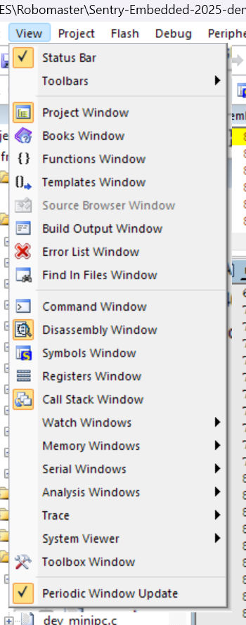

## 前言
由于我的运气不算太好，在学习嵌入式的过程中遇到了[巨量][大量][海量]的bug。受其折磨之余，也了解到了不少解决bug的办法，因此将其罗列如下，希望能有所帮助。
## Hardfault问题
FreeRTOS中很常见的一个问题就是Hardfault（硬件错误）通常来说其源头大概有三个：栈，指针，内核。  
### 栈
栈最主要的就是溢出。任何一个任务/函数的内容都是储存在栈中的，在函数生命周期开始被创建，在函数生命周期结束被销毁。但是，由于task有死循环，因此其中的内容一直是存在于栈上的，需要FreeRTOS分配栈大小。我们固然可以使用FreeRTOS给出的API来测算内存使用，但是更好的办法是动态分配内存，并且减少Config这类静态的资源在task中的声明。
### 指针
通常访问空指针，比如定义了一个uint8_t *ptr,但是没有给指定值就解引用，就会产生空指针错误。  
空指针错误可能隐藏在许多的问题背后，需要仔细研究。
### 内核
在基于MDK的（keil等）开发套件中，存在Semihosting(半主机模式)这一功能，其中规定了C语言的许多函数，比如printf,scanf等通常不会在嵌入式环境下使用的函数，能够通过半主机模式连接到电脑，从而实现相关功能。但是，MDK又不完全支持它，导致其功能实际无法使用，会引发报错。如果使用裁剪后的内核，比如microlib，就可以裁剪掉这部分（但是如果你声明了printf并且没有重定向，这就会导致系统找不到printf的实现从而编译报错或者干脆卡死（表现为debug点run没反应）等严重情况）。debug模式下，这些功能暂时被掩蔽，不会进入hardfault，只是表现为要多点几次RUN。但是如果你断开烧录线，就会发现出了问题。（本库设法避免了这个问题，但是还是提一嘴）
具体的解决办法请参考https://cloud.tencent.com/developer/article/2440771
## HardFault解决办法
首先就是要溯源。我们可以打开keil5，打开View-Call Stack Window

将代码跑到出问题的地方，停下。然后右键HardFault或其他函数等

点击Show Caller Code，就可以跳转到进入错误处理之前的函数位置。  
当然，直接看汇编也是一个方法。  
此方法也适用于其他的情况。  


## 任务不运行问题
这类问题包括:所有任务都不运行；某个任务不运行；除了某个任务都不运行。这三者造成的原因相似，但是解法不同。  
这里先讨论“某个任务不运行”：  
我们首先要知道任务是如何跑起来的。在Oskernal启动后，任务调度器开始对任务分级，此时各个任务处于就绪态，调度器会按照优先级顺序执行所有处于就绪状态的代码。注意，这个任务并非是“for”循环内的代码，而是整个task函数下的所有内容。因此，启动任务可以看作是把这个函数从头到尾跑一遍，只不过你里面塞了死循环才会反复运行。如果任务中使用了FreeRTOS的API（尤其是和等待/调度/队列有关的），就会进入“阻塞态”，此时任务被挂起，其他任务可以自由运行，直到这个API的等待逻辑结束。如果任务代码正在运行，就会进入“运行态”，此时任务依然在运行，但是也会被更高优先级的任务打断。  

这个问题可以被分为"运行了一次就不运行了”和“一直不运行”。  
一种通用的问题原因是堆栈溢出。任务初始化的时候分配了堆栈大小，但是可能会有动态分配内存，因此堆栈大小可能会崩，为了避免这个可以减少在函数内部声明的变量等，并且使用API查询堆栈大小（这个后续再讲），以及改大总内存configTOTAL_HEAP_SIZE等。还有堆内存和其他设置，这些暂时不在考虑范围内。
而运行了一次就不运行了，一般是因为任务进入了运行态/阻塞态。卡在运行态是什么意思呢，就是比如，你的任务中有一个死循环，一直占用着代码，但是任务优先级比较低，其他任务可以正常抢占CPU资源，这个任务则一直卡在这个死循环里，表现出来就是后面的代码都不运行了。至于阻塞态，就是任务中使用了一些os的API，比如队列等，一直在等待之类。比如向队列里面推送比整个队列都大的数据，导致一直无法成功，直接卡死，或者等待一些野指针返回数据之类。此时的任务会一直卡在阻塞态，调度器就不会运行它。  

一直不运行，则需要我们先弄清楚"运行"的概念。我们通常在for里面打个断点发现不停就认为任务没有运行了,但是实际上任务并不是只有循环内的部分，初始化的那部分也算在任务内，里面如果有死循环或者错误配置的osAPI还是会出现不运行的情况。其次，更高优先级的任务可能完全抢占了CPU，导致这个任务无法运行。关于这个，你可以查阅其任务句柄相关的变量，应该会有类似flag之类的指示其情况。  

除了某个任务都不运行，这可能是因为这个任务没进入阻塞态，一直以高优先级占用系统资源。

所有任务都不运行，可能是系统时钟配置错误，或者是因为在任务调度器进入之前就进入了死循环或者错误处理。


总之，不要在中断中使用OS API，并且谨慎使用死循环等。

## 控制问题
这类问题一般是由控制频率导致的，包括但不限于：异常抖动，反馈值异常跳变。

## 特殊问题
目前已知，H7芯片的内存有一部分无法被DMA访问，需要特殊处理。  


## “愚蠢”的错误
通常有一些错误是我们一时间没想到的。例如，某个特定任务不执行，它有可能是：  
1.忘记开osdelay，占用了整个线程  
2.在osdelay前进入了死循环，无法被同优先级任务调度使用   
3.很多c板的外设是需要上电的，比如CAN

## 善用调试工具
Keil提供了功能强大的调试工具。 
### SystemView
这是一个查看错误寄存器的有效工具。 

从菜单栏中，转到 View -> System Viewer。,然后在 System Viewer 窗口中，你可以展开并选择要检查的特定外设（例如 GPIO、USART、TIM），就可以查看其寄存器的当前值。

### 条件断点
有时候，手动打断点用起来不是那么方便。比如想要在一个循环的第N次停下来，如果手动打断点，那就要不停的点击单步运行。因此Keil提供了条件断点工具，能根据给定的条件触发断点。
具体可以参考https://blog.csdn.net/Z_H_Z_0/article/details/128305284
(最近的实验发现好像不行，可以改用以下的代码：)

```"c"
if(xxxxx条件)
{
__ASM volatile("BKPT #01");
}
```
满足条件，程序会自己停下
(未完待续)
